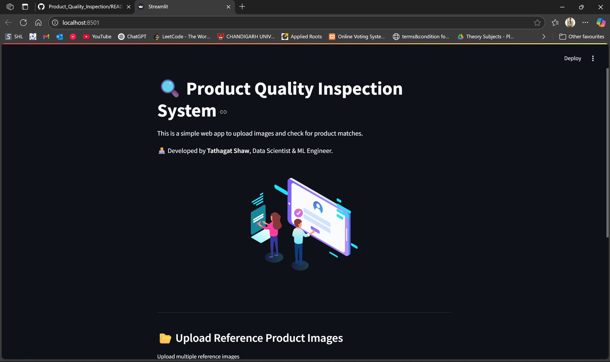
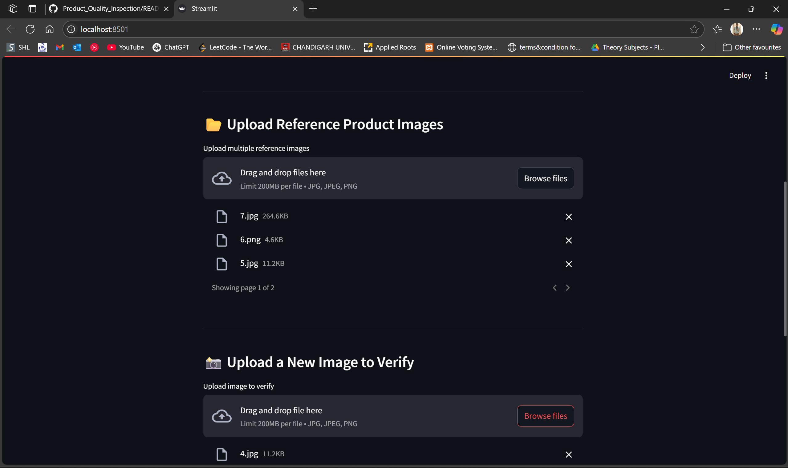
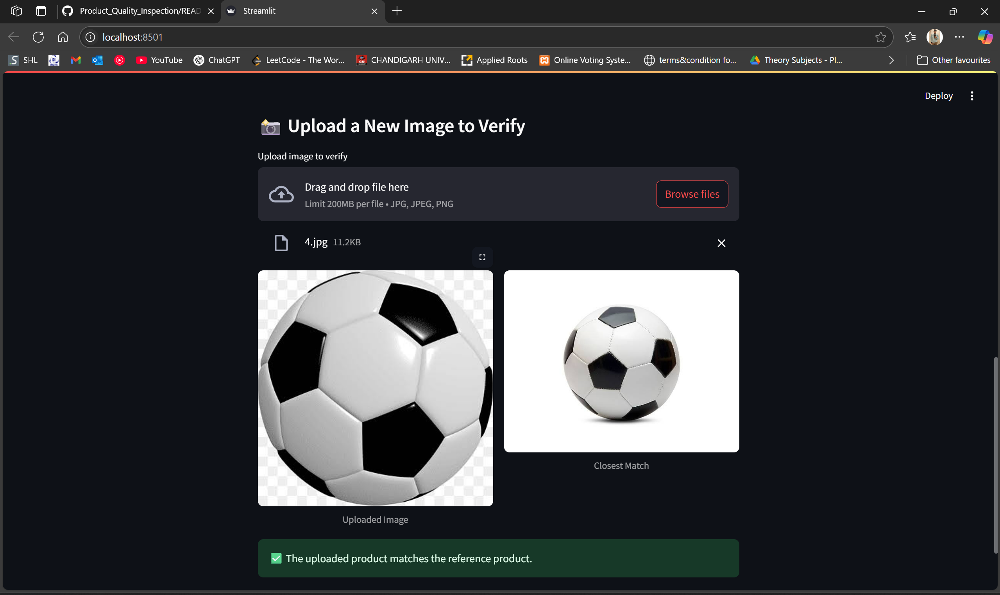

# Product_Quality_Inspection
Inspects the quality of the product manufactured in the industry by capturing multiple images of the product in the manufacturing line and matching the image of the new Product with the original product image.

Screenshots of the working Model:
.
.
.
